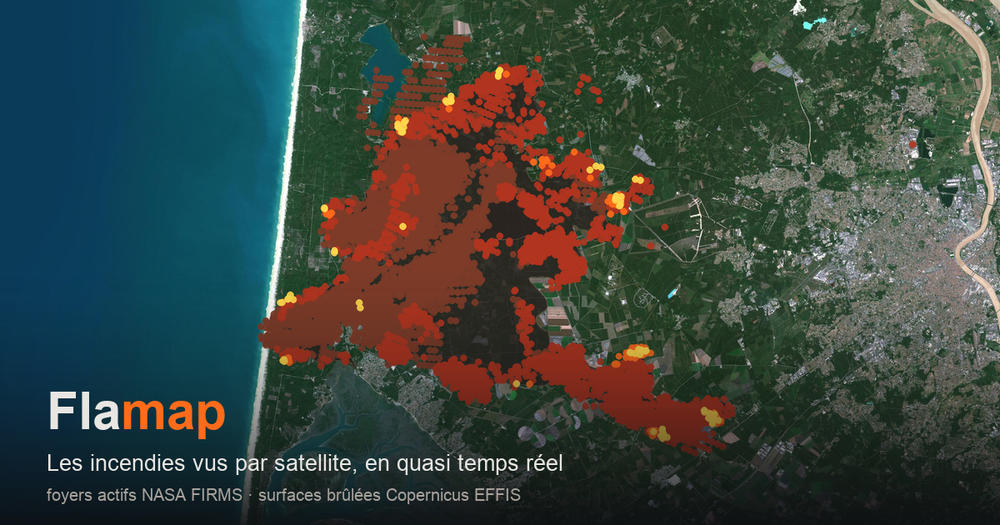

# Flamap

**[flamap.fr](https://flamap.fr) — la carte des incendies en France
métropolitaine, en quasi temps réel, à partir de données satellite publiques.**

Un script Python fabrique des fichiers statiques ; le navigateur les charge
progressivement selon le zoom. Pas de serveur, pas de base de données, pas de
clé d'API, pas de compte à créer.



## Ce que la carte montre

| Couche | Source | Rendu |
|---|---|---|
| **Foyers** | détections NASA FIRMS des 10 derniers jours | points, du jaune clair au brun sombre selon l'ancienneté |
| **Terre brûlée** | polygones Copernicus EFFIS | aplat sombre |
| **Incendies signalés** | suivi de l'association PSFDF | cercle coloré selon le statut |
| **Vent à 10 m** | modèle AROME HD via Open-Meteo | nappe de particules |
| **Fumée simulée** | foyers récents + champ de vent | panaches diffus, indicatifs |
| **Moyens aériens** | positions ADS-B Airplanes.live | appareils suivis, cap et fiche de vol |

Un **curseur temporel** rejoue la progression du feu sur dix jours. Un menu
**Calques** permet d'afficher ou masquer chaque famille, un panneau **Météo**
donne les prévisions horaires d'un point, et un bouton d'export produit une
image PNG ou un GIF de l'évolution.

La position et le zoom sont conservés dans le fragment `#map=` de l'URL : le
lien copié rouvre exactement la même vue.

## Démarrer en local

Il n'y a rien à installer : Python 3.12 et un navigateur suffisent.

```bash
git clone https://github.com/rozierguillaume/flamap.git
cd flamap
python3 -m http.server 8777
```

Puis ouvrir <http://localhost:8777>. Un jeu de données figé est versionné dans
`data/` pour que la carte s'affiche dès le clonage — les `fetch()` de la page
échouent en `file://`, il faut donc bien passer par un serveur.

Pour régénérer les données depuis les sources réelles :

```bash
python3 fetch_fires.py                      # France entière
python3 fetch_fires.py -1.6 44.2 -0.2 45.4  # une bbox : west south east north
```

Compter quelques minutes : le service WFS d'EFFIS répond parfois en plusieurs
dizaines de secondes, et les requêtes météo sont délibérément espacées.

## Choix techniques

Le projet est volontairement minimal, et cette contrainte est un choix de
conception plutôt qu'une étape provisoire :

- **site 100 % statique**, publié tel quel par GitHub Pages ;
- **aucun build, aucun bundler, aucun gestionnaire de paquets** — le front est
  écrit en modules ES natifs, chargés directement par le navigateur ;
- **collecteur en bibliothèque standard Python**, sans aucune dépendance ;
- **dépendances front vendorées** dans `vendor/` (MapLibre GL JS, gifenc), avec
  leur licence et leur empreinte, plutôt que servies par un CDN ;
- **aucune clé d'API** : toutes les sources utilisées sont publiques et anonymes ;
- **tests sans dépendance**, via `unittest` et le lanceur intégré de Node.

Le prix à payer est assumé : pas de TypeScript, pas de framework, et une
discipline de relecture qui remplace l'outillage.

## Organisation du dépôt

```text
index.html            la page ; css/ et js/ portent le front
js/main.js            assemble tous les contrôleurs
js/map/               création de la carte et fond satellite
js/data/              chargement initial et cellules de 1° chargées au zoom
js/timeline/          frise, lecture et graphiques d'activité
js/features/          foyers, surfaces brûlées, météo, PSFDF, moyens aériens
js/fx/                vent et fumée, dessinés au canvas
js/ui/, js/export/    panneaux, fiches au clic, export PNG et GIF
js/util/              fonctions pures, testées

fetch_fires.py        le collecteur, en ligne de commande
flamap/               un module par source : firms, effis, psfdf, meteo…
scripts/              assemblage, validation et vérification de l'artefact publié
tests/                tests Python et JavaScript, sur fixtures locales
data/                 jeu de démonstration versionné ; les données réelles ne le sont pas
```

Le front lit d'abord un aperçu national léger (quelques centaines de ko), puis
télécharge à partir du zoom 7 les cellules de 1° qui coupent l'écran. Avancer
dans le temps ne réécrit que des expressions de peinture MapLibre : le GeoJSON
n'est jamais renvoyé au moteur de rendu.

## D'où viennent les données

| Source | Ce qu'elle apporte | Rythme |
|---|---|---|
| **NASA FIRMS** | foyers actifs, VIIRS 375 m et MODIS | ~6 passages/jour, latence ~3 h |
| **Copernicus EFFIS** | polygones de surfaces brûlées | 1 à 2 publications/jour |
| **PSFDF** | incendies signalés et leur statut | au fil de l'eau |
| **Open-Meteo** | modèle AROME HD de Météo-France | pas horaire |
| **Airplanes.live** | positions ADS-B des moyens aériens | interrogé par le navigateur |
| **IGN, EOX, BAN** | fond satellite et nom de la commune | — |

`SOURCES.md` détaille ce que chaque source contient réellement, à quelle
fréquence, avec quels pièges — et pourquoi les bases françaises (BDIFF,
Prométhée) ne conviennent pas ici.

Le temps est continu, les données ne le sont pas : entre deux passages
satellite, il ne se passe littéralement rien dans les données. La frise regroupe
donc les détections par passage, et la vitesse de lecture accélère dans les
creux.

## Publication

Le site est déployé sur GitHub Pages par trois workflows GitHub Actions :

| Workflow | Quand | Quoi |
|---|---|---|
| `update-fire-deploy` | toutes les 30 min | foyers, périmètres, statuts, vent |
| `update-weather-deploy` | toutes les 6 h | grille de température |
| `update-front-deploy` | à chaque changement du front | le front seul, sans interroger les sources |

Un artefact Pages remplace toujours le précédent en entier : les trois workflows
partagent un verrou et reprennent du site publié tout ce qu'ils ne produisent
pas eux-mêmes. Si une source est indisponible, le déploiement est annulé et la
carte en ligne reste intacte — mieux vaut une carte un peu datée qu'une carte
vide.

**Les données rafraîchies ne sont jamais commitées** : plusieurs Mo par version,
plusieurs fois par heure, dans un dépôt dont le code utile tient en quelques
dizaines de ko.

## Contribuer

Les contributions sont bienvenues, en particulier les corrections de données,
les problèmes d'affichage sur un appareil donné et les améliorations
d'accessibilité.

Avant d'ouvrir une pull request :

```bash
python3 scripts/check_syntax.py
python3 -m unittest discover tests/python
node --experimental-default-type=module --test tests/js/*.test.js
```

Ces trois commandes sont exactement celles de l'intégration continue
(`.github/workflows/checks.yml`). Elles ne demandent aucune installation et
tournent sans réseau.

Quelques attentes, au-delà des tests :

- **le français** pour le code, les commentaires, les commits et l'interface ;
- **des commentaires qui expliquent le *pourquoi***, pas le *quoi* — beaucoup de
  choix du dépôt sont contre-intuitifs et documentés sur place ;
- **un commit = une préoccupation**, vérifiable et réversible ;
- **pas de nouvelle dépendance** sans en discuter d'abord dans une issue ;
- **vérifier le rendu à 1440, 820, 375 et 320 px** pour tout changement visuel,
  en rechargeant la page à la largeur voulue ;
- **aucune donnée générée dans le diff.**

Si un comportement vous paraît étrange, il l'est probablement pour une raison :
cherchez le commentaire avant de le corriger.

## Limites connues

- **Un hotspot n'est pas une surface brûlée.** C'est un pixel de 375 m où
  quelque chose de chaud a été vu à un instant donné ; agréger les détections
  surestime toujours la surface.
- **Les polygones EFFIS retardent** pendant la phase active d'un feu, avec un
  seuil de détection autour de 30 ha.
- **Un trou de plusieurs heures entre deux passages** peut aussi être de la
  fumée ou des nuages, pas une accalmie.
- **Faux positifs possibles** : torchères industrielles, centrales, panneaux
  solaires.
- **Le vent est un modèle, pas une mesure**, et la fumée n'est qu'une simulation
  indicative — ni observation satellite, ni mesure de qualité de l'air.
- **La température est sous-estimée dans les vallées encaissées**, faute de
  modèle d'élévation.
- Les positions de moyens aériens viennent d'un réseau communautaire :
  l'affichage n'est pas exhaustif et la proximité d'un feu ne confirme pas une
  mission.
- Tout est en UTC côté satellite ; l'affichage est converti en heure de Paris.

## Crédits

Les sources sont libres d'usage mais demandent d'être citées. Ces crédits sont
affichés dans l'interface et doivent y rester.

- Foyers actifs : **NASA FIRMS** (VIIRS 375 m et MODIS, LANCE/EOSDIS)
- Surfaces brûlées : **Copernicus EFFIS**
- Incendies signalés : **association PSFDF**
- Vent, température et précipitations : modèle **AROME HD** de Météo-France,
  servi par **Open-Meteo** (CC BY 4.0)
- Fond de carte : ortho-photo **IGN-F / Géoplateforme** (France) et
  **Sentinel-2 cloudless** par EOX ailleurs (données Copernicus Sentinel
  modifiées 2020) ; toponymes **CARTO** / **OpenStreetMap**
- Commune au point : géocodage inverse **Géoplateforme / BAN**
- Moyens aériens : **Airplanes.live** (ADS-B communautaire)
- Rendu : **MapLibre GL JS**

## Licence

Aucune licence n'est déclarée pour l'instant : le code est donc, par défaut,
tous droits réservés. À ajouter si le dépôt doit être réutilisable.
