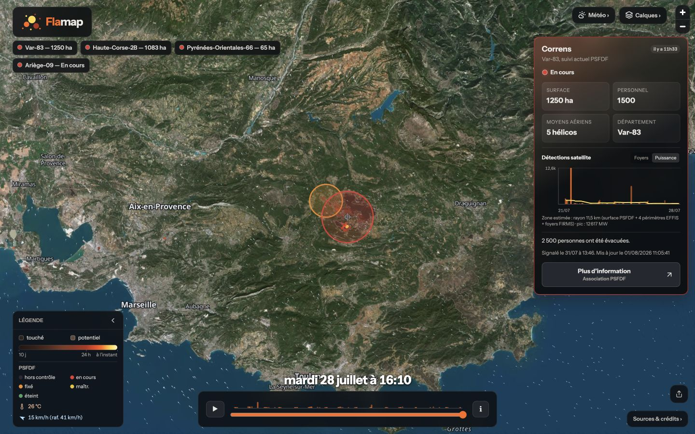
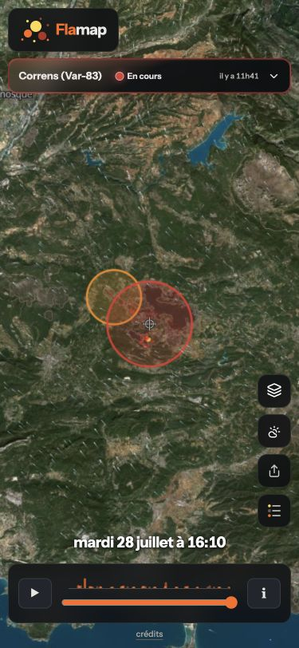

# Références du lot 0

Référence du front avant refactorisation, prise le 1er août 2026 sur le commit
`a1ca433dd659f1d1417fc743326112184b03c2b9`. La branche d'intégration est
`codex/refactor-integration` et le lot est travaillé sur
`codex/refactor-0-socle`.

## Environnement et protocole

- Mac Apple Silicon, macOS/Darwin arm64, 12 processeurs logiques ;
- Chromium 150, DPR 2 ;
- viewport des mesures : 1280 × 720 ;
- viewports des captures : 1440 × 900 et 375 × 812 ;
- Python 3.12.8 et Node.js 26.5.0 ;
- serveur local sans cache applicatif :
  `python3 scripts/serve_no_cache.py --port 8777` ;
- fin de l'initialisation (`initReady`) : le bouton d'export devient actif ;
- affichage initial (`mapReady`) : l'initialisation est finie, la caméra ne se
  déplace plus, les tuiles MapLibre sont chargées et deux frames supplémentaires
  ont été peintes. Les zones détaillées, chargées par `fetch()`, sont comptées
  séparément dans l'inventaire réseau ;
- lecture : 30 secondes continues, relancée automatiquement après les 23
  secondes d'un cycle desktop ;
- mémoire : `performance.memory` avant, puis min/médiane/max d'un échantillon
  par seconde pendant la dernière minute des cinq minutes avec vent et fumée
  actifs. Les avions sont coupés après l'inventaire réseau initial afin d'isoler
  ce scénario.

Le serveur ajoute `Cache-Control: no-store` et retire les validateurs
conditionnels pour que les ressources locales répondent avec leur corps complet.
Le profil du navigateur peut cependant conserver les dépendances et tuiles
externes. Les trois passages finaux donnent 2 099, 1 797 et 1 935 ms jusqu'à
`mapReady`, soit 1 935 ms de médiane. Une future trace DevTools stricte devra
être comparée à une autre trace DevTools, pas directement à ces valeurs.

Chrome DevTools MCP n'était pas configuré dans l'environnement du lot 0. Les
mesures viennent du banc `scripts/benchmark_lot0.html`, de Resource Timing, de
`requestAnimationFrame` et de `performance.memory`.

Pour rejouer le banc long, ouvrir
`http://127.0.0.1:8777/scripts/benchmark_lot0.html`. Ajouter `?long=0` limite le
passage à l'initialisation et aux cinq secondes de réseau qui la suivent. Garder
l'onglet visible : masquer l'onglet suspend volontairement les animations. Le
banc coupe les couches et retire son iframe après la mesure ou après une erreur.

Depuis le lot 4, le banc importe dans l'iframe l'API de mesure explicite et
immuable renvoyée par `getMeasurementApi()`. L'état de la carte, `show()` et
l'état de lecture restent privés au module ; seules des lectures et les bornes
de début/fin de mesure sont exposées. Les durées continuent à couvrir le corps
complet de chaque appel à `show()` pendant la lecture.

## Budgets de référence

| Mesure | Référence avant refactor |
|---|---:|
| Initialisation applicative `initReady`, médiane de 3 passages | 910 ms |
| Affichage initial `mapReady`, premier passage local sans cache | 2 099 ms |
| Affichage initial `mapReady`, médiane de 3 passages | 1 935 ms |
| Front propriétaire transféré par le serveur local | 275 862 octets |
| Source propriétaire HTML + CSS + JS, sans en-têtes | 275 562 octets |
| Source propriétaire compressée avec gzip -9 | 81 493 octets |
| Front initial avec MapLibre et la mesure d'audience, transfert compressé observé | 563 336 octets |
| Requêtes de données au démarrage | 11 |
| Coût de `show()`, moyenne / médiane / p95 | 0,818 / 0,800 / 1,000 ms |
| Coût de `show()`, maximum observé / appels | 6,5 ms / 1 105 à 1 132 |
| Cadence rAF au repos avant lecture | 25 ms (40 Hz) |
| Frames perdues sur 30 s contre la cadence au repos | 31 à 63, soit 2,59 à 5,26 points |
| Frames effectivement rendues / durée | 1 136 à 1 169 / 29 960 à 29 967 ms |
| Mémoire JS utilisée après 5 min vent + fumée, médiane de 3 séries | 25 411 929 octets (24,23 Mio) |
| Médianes mémoire des 3 séries | 25 205 573 à 26 190 980 octets |
| Mémoire JS totale après 5 min, médiane des 3 séries | 30 715 565 octets (29,29 Mio) |

Chaque série mémoire contient 60 échantillons sur la dernière minute. Les
médianes du tas utilisé varient de 3,91 % entre leurs extrêmes ; les minima et
maxima globaux sont 25 169 620 et 27 359 710 octets. Pour les lots suivants,
comparer la médiane de trois séries au 25 411 929 retenu ici et répéter toute
hausse apparente avant de conclure à une régression. Le tas avant lecture varie
beaucoup avec la phase du ramasse-miettes et n'est pas un seuil.

Deux passages de lecture ont été exécutés avec le protocole final. Le tableau
retient les plages observées et, pour le coût de `show()` et les frames perdues,
la borne la plus conservatrice.

La cadence au repos est un garde-fou à part entière : elle reste comparée aux
25 ms du lot 0 et ne doit jamais être recalibrée sur le lot courant. Une médiane
supérieure à 27,5 ms (+10 %) bloque le lot, même si le pourcentage de frames
perdues pendant la lecture reste stable. Ce second pourcentage isole seulement
le coût ajouté par la frise par rapport au vent et à la fumée déjà actifs ; la
ligne de cadence détecte une régression commune aux trois boucles.

Les 563 336 octets de front initial additionnent le document servi localement
(275 562 octets de corps), MapLibre JS (275 472 octets compressés), MapLibre CSS
(10 078 octets) et le script de mesure d'audience (2 224 octets). Les corps
externes ont été mesurés séparément car Resource Timing ne publie pas leur taille
sans en-tête `Timing-Allow-Origin`. `gifenc` est chargé seulement lors d'un
export GIF et n'entre pas dans le démarrage.

Les corps externes ont été relevés avec :

```bash
curl -sL -o /tmp/flamap-asset -w '%{url_effective}\n%{size_download}\n' URL
shasum -a 256 /tmp/flamap-asset
curl -sL --compressed -o /dev/null -w '%{size_download}\n' URL
```

| Ressource résolue le 01/08/2026 | Octets bruts | SHA-256 |
|---|---:|---|
| MapLibre JS 5.24.0 | 1 056 837 | `45a9b07a9189ce56054c620a947ccf41e291e58c95e9b61533b740aaa65ee5cb` |
| MapLibre CSS 5.24.0 | 70 024 | `ab1e70d59ec40465bae7e7030da2f3ccf28133fd502e62bd598eefbadfd7a732` |
| `analytics.flamap.fr/script.js` | 4 595 | `be444c289ac019af8486b50fe2bbf2fdb2890812fb945dc78940b6781a68ac52` |
| source vectorielle TileJSON `tiles.openfreemap.org/planet` | 19 254 | `e273bde40f01234ad1e5d46b881d9db8e5f7560c1ee137fcf25983e0db93bb9c` |

Le code charge `maplibre-gl@5`, non figé : une autre version résolue ou une
empreinte externe différente invalide une comparaison de chargement. Le
vendoring et le verrouillage des versions restent prévus au lot 16.

## Requêtes réseau de référence

Huit requêtes de données partent sans attendre l'initialisation MapLibre :

1. `data/manifest.json` ;
2. `data/overview_hotspots.geojson` ;
3. `data/burnt_recent.geojson` ;
4. `data/psfdf_fires.geojson` ;
5. `data/timeline.json` ;
6. `data/wind_coarse.json?v=2` ;
7. `data/weather_forecast.json?v=4` ;
8. `data/thermal.json`.

`thermal.json` était absent du jeu local et répondait `404`, repli attendu vers
la température grossière de `wind_coarse.json`. Après le cadrage sur Correns,
trois zones ont été chargées : `x+05_y+43`, `x+06_y+43` et `x+07_y+43`. Le
scénario compte donc 11 requêtes de données. Les sept corps nationaux présents
représentaient 1 379 375 octets et les trois zones 954 754 octets.

Si la première vague nationale échoue, le chemin legacy demande à la place
`burnt_nrt.geojson`, `burnt_dated.geojson`, `hotspots.geojson`, `meta.json` et,
de manière facultative, `wind.json`. Ce chemin de repli n'a pas été déclenché
pendant la référence.

Le fond de carte charge séparément MapLibre, la source vectorielle OpenFreeMap, les glyphes,
les tuiles Sentinel-2 EOX puis les orthophotos IGN. Le nombre de tuiles dépend du
viewport et du cadrage ; il ne doit pas servir seul de budget. Le nombre de
requêtes de données Flamap ci-dessus est le garde-fou stable.

### Avions avant le lot 1

L'état préexistant active les avions au chargement, malgré le commentaire qui
les décrit comme opt-in. Il produit :

- une requête facultative vers `https://api.flamap.fr/aircraft-history`, avec
  abandon après 4 s ;
- une requête `cache: no-store` vers `https://api.airplanes.live/v2/hex/...` au
  démarrage, puis un départ toutes les 4 s ;
- aucun nouveau départ lorsque la couche est coupée, la frise est dans le passé
  ou l'onglet est masqué ; la requête en cours est alors abandonnée.

Sur les cinq secondes suivant l'initialisation, une requête d'historique et
deux requêtes Airplanes.live ont été observées. La couche a ensuite été coupée :
aucune requête aérienne supplémentaire n'est apparue pendant les cinq minutes
du test. Le lot 1 conserve finalement cette activation par défaut, conformément
à la décision explicite de l'utilisateur.

## Jeu de données utilisé

Le manifeste porte `generated_at = 2026-07-28T16:20:27.615573+00:00`. Les
données restent ignorées par Git ; vérifier ces empreintes avant toute
comparaison stricte :

| Fichier | Octets | SHA-256 |
|---|---:|---|
| `data/manifest.json` | 3 610 | `c6aa0c102d35a7013d8a5071dbb921a6f85f0bac433cfac5051c29e520d57663` |
| `data/overview_hotspots.geojson` | 409 885 | `69c1612c44b960ff1dd5ee87b543dc56368f6c10c81dd5aa61f24e40ef1c92b1` |
| `data/burnt_recent.geojson` | 263 426 | `51146bbe7016da156de3272d3afcdc2a034edb88c5cbb0dbad72c96e5f1b1efb` |
| `data/psfdf_fires.geojson` | 8 428 | `ce9911a9e095901347855401be60d8e4241d8cdb8188262f8417ef4557c1f416` |
| `data/timeline.json` | 12 629 | `e1422bdd571466aba5cc998c507bfb5890371f90d8310348389df4c23086971d` |
| `data/wind_coarse.json` | 565 320 | `1dec3e0b548774e5037b3a7e5f812317cb68a581e42fca0ae1b34cb9078ec413` |
| `data/weather_forecast.json` | 116 077 | `9147c5b1de75597ad4b9f3b5af142be07e1d3bd41b8a0cb1a6b09b220014a57d` |
| `data/zones/x+05_y+43.json` | 203 320 | `8c910d1f76ada1a87ed814c64908f2195e458b6ece2b52bb2e307419360f69bd` |
| `data/zones/x+06_y+43.json` | 713 024 | `e9651076a8527e2efd932ca36a99ee0e7f92484150f9fe815b9a3cd520861dc3` |
| `data/zones/x+07_y+43.json` | 38 410 | `04f126ab0c636a6a2a9284044a4f0b188b42e65056b696d2b7d77bcdac38a122` |

## Captures visuelles

### Desktop — 1440 × 900



### Mobile — 375 × 812



Les deux captures montrent le cadrage automatique sur Correns, les nappes de
vent et de fumée, la frise au dernier cran observé et le panneau PSFDF adapté au
format. Elles servent de comparaison visuelle, pas de test pixel à pixel : les
tuiles et les données externes peuvent évoluer.

## Contrôles de syntaxe

Exécuter :

```bash
python3 scripts/check_syntax.py
git diff --check
```

Le premier contrôle compile les quatre scripts Python vers un répertoire
temporaire et passe `node --check` sur les scripts inline de `index.html`,
`social.html`, `mentions-legales.html` et du banc de mesure. Dès que `js/`
existe, il vérifie aussi récursivement ses fichiers comme modules ES. Il ne crée
ni `__pycache__` ni dépendance de projet.
